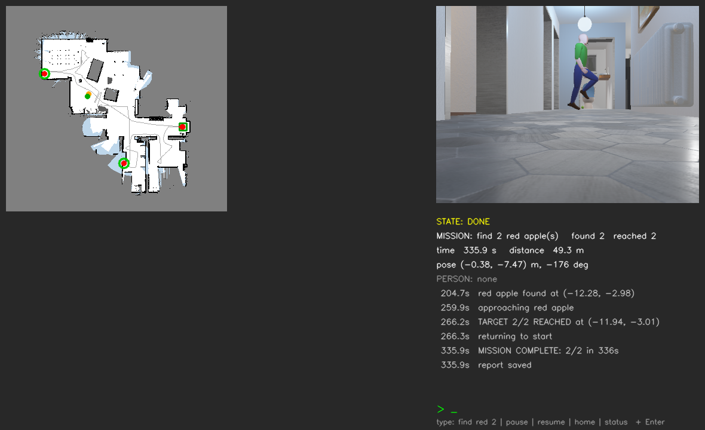
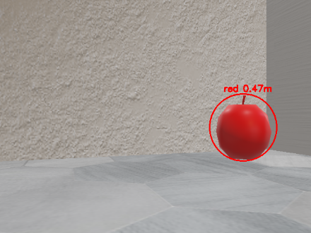
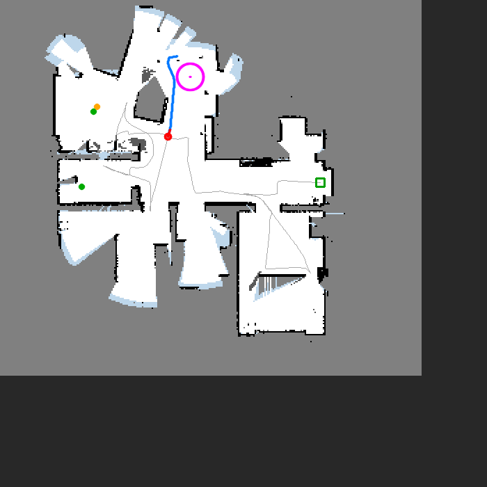
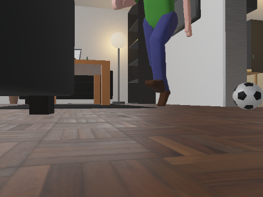
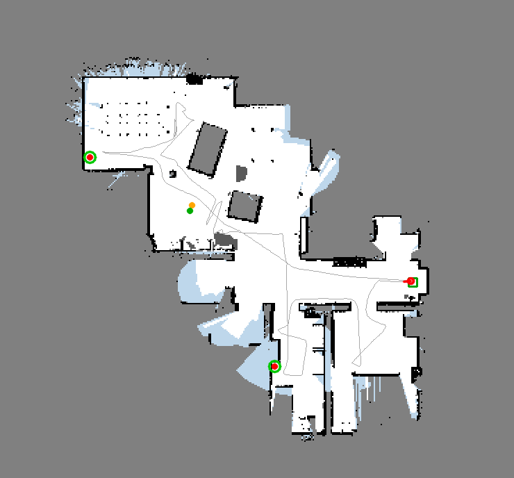

# PNU TECH WEEK 2026 Autonomous Search and Rescue

2026 부산대학교 TECH WEEK 해커톤 "Autonomous Search and Rescue" 과제의 구현 코드입니다.

TurtleBot3 Burger가 사전 지도 없이 처음 보는 집 안을 탐색하며 지도를 만들고, 빨간 사과 2개를 찾아 각각 가까이 간 뒤 출발한 자리로 돌아옵니다. 집 안을 걸어 다니는 사람은 피해 다녀야 합니다. 



## 결과

| 항목 | 결과 |
|---|---|
| 완주 | 4회 중 4회 (시작 위치를 2~4 cm씩 다르게) |
| 최단 완주 시간 | 336초 |
| 복귀 오차 (실제 위치 기준) | 4~11 cm |
| 위치 추정 오차 | 평균 2~6 cm, 최대 약 12 cm |
| 사과 탐지 (시험 영상 288장) | 빨간 사과 오탐 0건 |

## 핵심 알고리즘

| 단계 | 방법 | 한 줄 설명 |
|---|---|---|
| 위치 추정 | Encoder + Compass + Scan-to-Map Matching | 바퀴로 거리, 나침반으로 방향을 재고, LiDAR 스캔이 지도와 어긋나면 위치를 고칩니다. |
| 지도 작성 | Log-odds Occupancy Grid | 5 cm 칸마다 벽과 빈 공간의 점수를 쌓습니다. 카메라로 본 바닥, 카펫, 유리 같은 보이지 않는 장애물은 별도 레이어에 기록합니다. |
| 사과 탐지 | HSV 색 + 원형도 + 바닥 위치 조건 | 빨갛고 둥글고 바닥에 놓인 물체만 사과로 봅니다. 거리는 영상 속 크기로 계산합니다 (`Z = f x R / r`). |
| 탐색 | 시야 기반 Frontier | LiDAR가 아니라 카메라로 실제로 본 바닥을 기준으로, 아직 못 본 곳을 다음 목표로 잡습니다. |
| 경로 계획 | Costmap + A* | 벽 근처를 비싸게 매긴 지도 위에서 A*로 안전한 최단 경로를 찾습니다. |
| 주행 | Pure Pursuit | 경로의 0.3 m 앞 점을 따라갑니다. |
| 사람 회피 | Scan-to-Scan 움직임 감지 + 6초 예측 | 움직이는 사람을 찾아 6초 뒤까지의 경로를 예측하고, 멈춰서 양보하거나 미리 비켜 갑니다. |
| 판단 | FSM | SPIN > EXPLORE / LOOK > APPROACH > CONFIRM > RETURN > DONE |
| 사람과 공유 | 텍스트 명령 + 대시보드 | `find 2 red apples`, `pause`, `resume`, `home`, `status` 명령과 실시간 지도, 임무 보고서를 제공합니다. |

알고리즘별 자세한 설명과 선택 이유, 한계는 [controllers/sar_mission/README.md](controllers/sar_mission/README.md)에 있습니다.

| 사과 탐지 | 사람 감지 (보라색 원) | 사람 감지 순간의 카메라 |
|---|---|---|
|  |  |  |



## 폴더 구성

```
controllers/
  sar_mission/       최종 제출 컨트롤러 (단일 파일) 와 상세 README
  sar_referee/       검증용 심판 컨트롤러 (Supervisor, 제출물 아님)
  sar_mapping/       1, 2단계 연습: 위치 추정과 지도 작성
  sar_mapping_eval/  1, 2단계 검증 코드와 결과
docs/images/         주행 캡처 화면
presentation/        발표 자료
```

## 실행 방법

이 레포에는 직접 작성한 코드만 들어 있습니다. 시뮬레이션 월드와 로봇 모델은 강의 레포에 있습니다.

1. Webots R2025a와 Python 3.10을 준비합니다 (`numpy`, `opencv-python` 필요).
2. 강의 레포를 받습니다: [kyu-rae-kim/PNU-TECHWEEK-260930](https://github.com/kyu-rae-kim/PNU-TECHWEEK-260930)
3. 이 레포의 `controllers/sar_mission/` 폴더를 강의 레포의 `controllers/` 아래에 복사합니다.
4. `worlds/apartment.wbt`에서 TurtleBot3Burger의 `controller`를 `"sar_mission"`으로 바꾸고 실행합니다.

```
TurtleBot3Burger {
  translation -0.3 -7.5 0
  rotation 0 0 1 3.14159
  controller "sar_mission"
}
```

시작 지점을 바꾸려면 `controllerArgs [ "start=-0.3,-7.5,3.14159" ]`처럼 넘깁니다. 실행 인자와 텍스트 명령의 전체 목록은 [상세 README](controllers/sar_mission/README.md)에 있습니다.

## 검증 방법

`sar_referee`는 임무 컨트롤러와 별개인 Supervisor 로봇입니다. 임무 컨트롤러는 GPS나 정답 위치 없이 실제 조건 그대로 두고, 밖에서 실제 위치 오차, 접촉, 사람과의 거리, 사과 접근 거리, 복귀 오차를 측정합니다. 사용하려면 월드에서 로봇에 `DEF TB3`, 사람에 `DEF PED`를 붙이고 아래 로봇을 추가합니다.

```
Robot {
  name "referee"
  controller "sar_referee"
  controllerArgs [ "1500" "run1" ]
  supervisor TRUE
}
```
